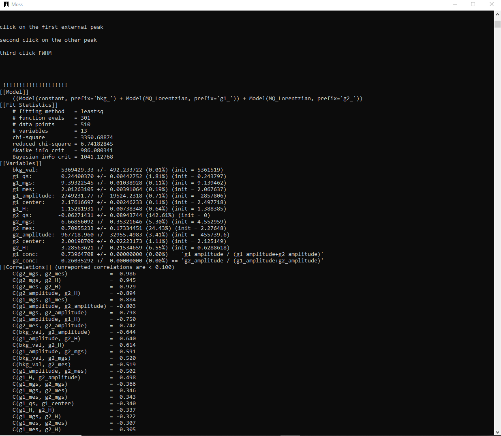
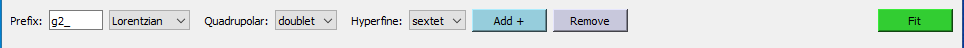
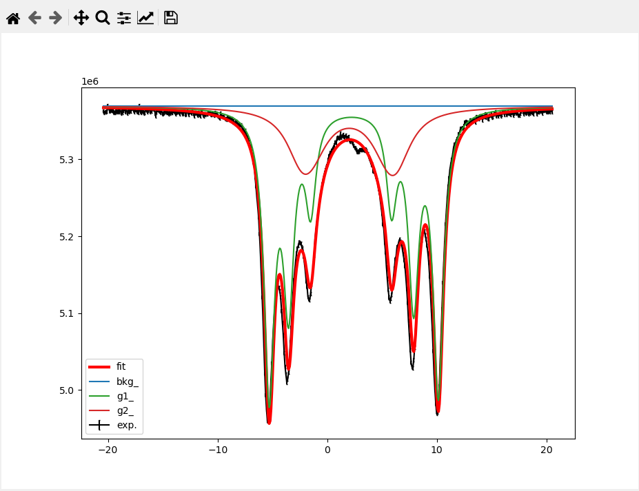

## Welcome to Moss
### fitting softly

The program *Moss*(fitting softly) is designed by the idea to have an easy and interacting fit of Mössbauer spectra.
The full spectra is defined as a sum of several contributions (sites, species) plus a constant background. 
At the moment are implemented lorentzian, pseuvovoight and gaussian lineshapes, and the contribution could be defined as singlets,doublets and sextets.
The fitting parameters of each contribution are isomer shift, FWHM, quadrupole splitting and hyperfine magnetic field splitting.
Each fit parameter could be fixed to a certain value or optimized. It is possible also to limit the acceptable value of a parameter into a certain range or constrain two fit parameters also from different contribution with a simple equation. 
Each contribution is characterized by an unique set of character (*ex.* "g1_") that would be used as prefix for all the fitting parameters related to the contribution (*ex* FWHM, "g1_H", Isomer Shift  "g1_center",  quadrupole splitting  "g1_mgs", hyperfine magnetic field splitting  "g1_mes", Intensity g1_amplitude)

The program written in Python making use of the lmfit library for fitting and matplotlib for graphycal representation and the toolkit used is pyQT5.
The optimization is performed by Levenberg–Marquardt least-squares method as implemented in scipy library. Such method is known to be biased by the choice of initial parameters of fitting model, however we consider to mitigate such problem by the use of a fully interactive user interface allowing to easily explore the space of solutions without the necessity of minimization.


From the point of view of the user the program appears as two windows:
* ### a shell like windows (Figure 1) in which info and fit results are printed, for interaction with the user:



* ### A  graphical user interface (GUI) that allows to build and modifies fitting model:


======

The gui is composed of three frames placed in a column 
the **header** frame allows to add and remove contributions (sites, species) to the spectra. The type of contribution is defined by the values of combobox widgets and, after the button  "Add +" is pressed a set of instruction about how interact with the program will appear in the shell window.


The **graphic** frame allows to modify with mouse interaction. On the top of the frame a series of button to zoom/pan change colors, and save the images are present. A video showing the possible user interactions is embedded on the end of the this webpage. 



the **eval** frames allows to directly send instructions to the lmfit library. It will allows to set constrains or range limits for different parameters, a set of instruction examples are printed on the line.
At present this set of instruction has been implemented
- ***setconstrain('g1_H', 'g2_H*2')***  set that parameter g1_H must be 2 times parameter g2_H
- ***setvalue('g1_center', 5)***  set initial parameter g1_center to the 5 value
- ***setlimits('g1_mgs', 'min', 2)***  set minimum for parameter 'g1_mgs' 
- ***setlimits('g1_mgs', 'max', 5)***  set maximum for parameter 'g1_mgs' 
- ***setlimits('g1_H', 'vary', False)***  fix parameter 'g1_H' to the current value
- ***printParams()*** print on the shell the definition of parasmeter, useful to check ;-)


Moss is devoted to the rapid and user interactive analysis of complex Mössbauer spectra, made possible by its interactive graphical user input without any programming knowledge.
At the moment Moss does not perform complete transmission integrals, and any kind of quadrupole splitting distributions are implemented and it will therefore not be suited for a complete analysis of all types of Mössbauer spectra. The program is still in a beta stage and improvements are in progress of implementation.

<iframe width="560" height="315"  src="https://www.youtube.com/embed/ypmjMZGB43E" frameborder="0" allow="autoplay; encrypted-media" allowfullscreen></iframe>


```markdown


<iframe width="560" height="315" src="https://www.youtube.com/embed/dQw4w9WgXcQ" frameborder="0" allow="autoplay; encrypted-media" allowfullscreen></iframe>
```

