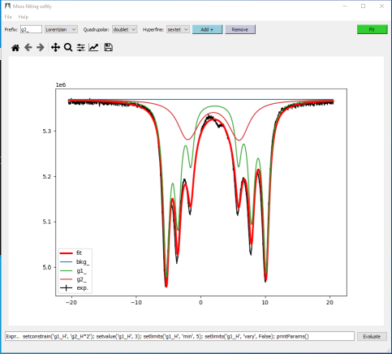

## Welcome to Moss
### fitting softly

The program *Moss*(fitting softly) is designed by the idea to have an easy and interacting fit of Mossbauer spectra.
The full spectra is defined as a sum of several contributions (sites, species) plus a constant background. 
At the moment are implemented lorentzian, pseuvovoight and gaussian lineshapes, and the contribution could be defined as singlets,doublets and sextets.
The the fitting parameters of each contribution are center shift, FWHM, quadrupole splitting and magnetic hyperfine splitting.

The program written in Python making use of the lmfit library for fitting and matplotlib for graphycal representation and the toolkit used is pyQT5.
The optimization is performed by Levenberg–Marquardt least-squares method as implemented in scipy library. Such method is known to be be biased by the choice of initial parameters of fitting model, however we consider to mitigarte such problem by the use of a fully interactive user interface allowing to easily explore the space of solutions without ther necessity of minimization.

From the point of view of the user the program appears as two windows:
* a shell like windows (Figure 1) in which info and fit results are printed, for interaction with the user:

* A  graphical user interface (GUI) that allows to build and modifies fitting model:


can be kept constant or can be constrained to fall within specific ranges intheir search space during fitting


straightforward approach to the fitting of 57Fe conventional and synchrotron energy-domain Mo ̈ssbauer spectra. Sites can bedefined simply by mouse clicks and hyperfine parameters can be constrained toconstant values, within specific ranges, and can be coupled linearly between different subspectra. 

The program includes a full transmission integral fit withLorentzian line shape (conventional source) or Lorentzian-squared line shape(synchrotron source). The fitting process is graphically displayed in real timewhile fitting and can be interrupted at any time. Gaussian-shaped quadrupolesplitting distributions for analyzing nonmagnetic amorphous materials areincluded.MossAis designed especially for the rapid and comprehensive analysisof complex Mo ̈ssbauer spectra, made possible by its native graphical user input.

At the moment Moss does not perform complete transmission integrals, and will therefore not be suited for a complete analysis of all types of Mössbauer spectra.

Fitted spectra may be printed, fits saved, data files exported for graph creation in other programs, and analysis tables and reports may be exported as plain text or LaTeX files. With Fit ;o) even an inexperienced user can analyze and fit relatively complex Mössbauer spectra of mineralogical samples quickly without programming knowledge.


```markdown
Syntax highlighted code block

# Header 1
## Header 2
### Header 3

- Bulleted
- List

1. Numbered
2. List

**Bold** and _Italic_ and `Code` text

[Link](url) and 
```

For more details see [GitHub Flavored Markdown](https://guides.github.com/features/mastering-markdown/).

### Jekyll Themes

Your Pages site will use the layout and styles from the Jekyll theme you have selected in your [repository settings](https://github.com/Prestipino/Moss/settings). The name of this theme is saved in the Jekyll `_config.yml` configuration file.

### Support or Contact

Having trouble with Pages? Check out our [documentation](https://docs.github.com/categories/github-pages-basics/) or [contact support](https://github.com/contact) and we’ll help you sort it out.
