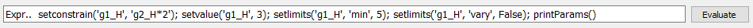

## Welcome to Moss
### fitting softly

The program *Moss*(fitting softly) is designed by the idea to have an easy and interacting fit of Mossbauer spectra.
The full spectra is defined as a sum of several contributions (sites, species) plus a constant background. 
At the moment are implemented lorentzian, pseuvovoight and gaussian lineshapes, and the contribution could be defined as singlets,doublets and sextets.
The the fitting parameters of each contribution are center shift, FWHM, quadrupole splitting and magnetic hyperfine splitting.
Each fit parameter could be fixed to a certain value or optimized, it is possible also to limit the the acceptable value of a parameter into a certain range or constrain two fit parameters also from different contribution with a simple equation. 

The program written in Python making use of the lmfit library for fitting and matplotlib for graphycal representation and the toolkit used is pyQT5.
The optimization is performed by Levenberg–Marquardt least-squares method as implemented in scipy library. Such method is known to be be biased by the choice of initial parameters of fitting model, however we consider to mitigate such problem by the use of a fully interactive user interface allowing to easily explore the space of solutions without ther necessity of minimization.

From the point of view of the user the program appears as two windows:
* ### a shell like windows (Figure 1) in which info and fit results are printed, for interaction with the user:


* ### A  graphical user interface (GUI) that allows to build and modifies fitting model:


the gui is composed of three rows
the **header** that allows to add and remove contributions. The kind of contribution is defined by the values of combobox widget, after the button  "Add +" is pressed a set of instruction about how interact with the program will appear in the shell windows


the **graphic** that allows to modifies with mouse interaction . on the top a series of button to zoom and save the pictures

<iframe width="560" height="315"  src="https://www.youtube.com/embed/ypmjMZGB43E" frameborder="0" allow="accelerometer; autoplay; clipboard-write; encrypted-media; gyroscope; picture-in-picture" allowfullscreen></iframe>

the **eval** that allows to set constrain



Moss is devoted to the rapid and user interactive analysisof complex Mossbauer spectra, made possible by its interactive graphical user input without any programming knowledge.
At the moment Moss does not perform complete transmission integrals, and any kind of quadrupolesplitting distributions are implemented and it will therefore not be suited for a complete analysis of all types of Mössbauer spectra.


<iframe width="560" height="315" src="https://www.youtube.com/embed/dQw4w9WgXcQ" frameborder="0" allow="autoplay; encrypted-media" allowfullscreen></iframe>


```markdown

```

